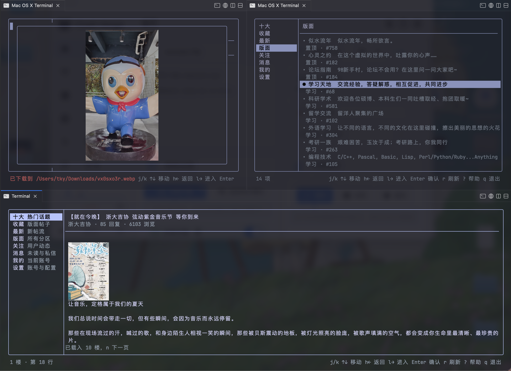
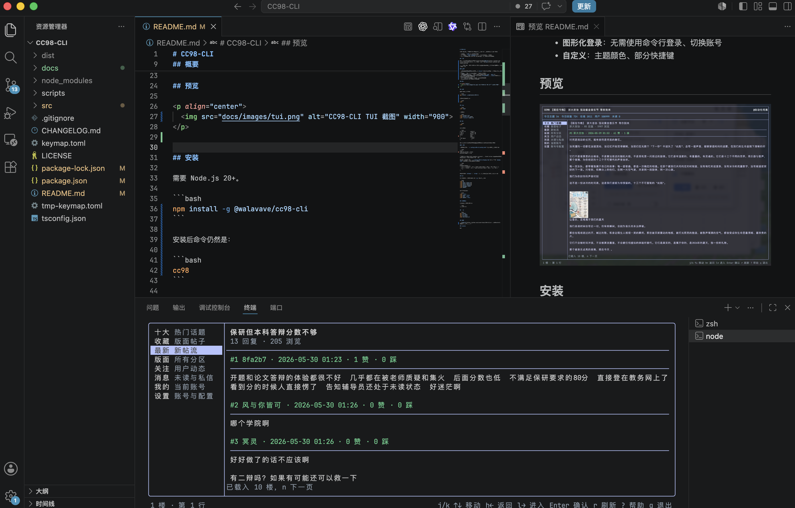

# CC98-CLI

CC98 的命令行客户端，有适合日常浏览的 TUI，以及面向脚本使用的 CLI 。

- 直接运行 `cc98`：进入终端界面。
- 带参数运行 `cc98 <command>`：执行 CLI，默认输出 JSON。
- 当前主要面向读取场景，TUI 会尽量按需加载和缓存，减少请求。

## 概要

这是一个个人兴趣项目，改版自Lucent-Snow的[CC98-CLI](https://github.com/Lucent-Snow/CC98-CLI)，风格和TUI布局模式参考[Yazi](https://github.com/sxyazi/yazi)。

基于 CC98 的公开接口实现，与 CC98 官方无关。请合理使用本工具，避免违反 CC98 的用户协议。

### 特色

- **支持WebVPN、RVPN**：RVPN使用`atrust`验证；魔法VPN不开启TUN模式下也可以使用
- **支持鼠标点击/滚动**：支持鼠标左右拉动分割线
- **支持评论**：支持简短评论，附带表情包预览弹窗
- **支持文件下载**：鼠标点击链接下载文件，支持`.pdf` `.docs`等
- **图片预览（快捷键预览大图）**：支持`Kitty（KPG）`和`iterm2`渲染，在基于libghostty的终端上完成验证
- **图形化登录**：无需使用命令行登录、切换账号
- **Yazi风格**：伪装Yazi文件管理器；q键退出，终端不留痕
- **自定义**：主题颜色、部分快捷键、回复小尾巴

## 预览

<p align="center">
  
  
</p>

## 安装

需要 Node.js 20+。

```bash
npm install -g @walavave/cc98-cli
```

安装后命令是：

```bash
cc98
```

## 登录

```bash
cc98 login
```

多账号：

```bash
cc98 account list
cc98 account use <name>
cc98 --account <name> me
```

登录成功后会按账号自动执行每日签到；默认每天最多尝试一次，使用北京时间日期判断。

如需关闭：

```toml
[account]
auto_signin = false
```

也可以手动执行：

```bash
cc98 me signin
```

## TUI

```bash
cc98
```

常用按键：

```text
j/k 或 ↑/↓        上下移动
l 或 →            进入下一层
h 或 ←            返回上一层
Enter             确认执行
f                 跳到搜索框
r                 刷新
?                 显示帮助
n 或 Space        加载更多
a                 用户页关注 / 取消关注
a / s             对当前楼层点赞 / 点踩
c                 帖子评论 / 私聊发送输入框
d                 收藏 / 取消收藏当前帖子
Shift+Enter       评论框内换行
q                 退出
```

左栏导航包含：十大、收藏、最新、搜索、版面、关注、消息、我的、设置。

### 配置

配置文件路径为 `~/.config/cc98-cli/config.toml`，未设置时使用默认值。

```toml
[tui]
hide_top_chrome = false
preview_images = true
navigation_history_limit = 10
post_signature = "[right][color=#808080]——来自终端应用[/color]「[b][url=https://github.com/walavave/CC98-CLI]CC98 CLI[/url][/b]」[/right]"
```

图片预览目前支持 Kitty graphics protocol 和 iTerm2 inline image。若终端不支持对应协议，会保留文本图片占位。

`post_signature` 只会在发送评论时追加到正文末尾，不会显示在编辑中的评论框里；支持 `\n`、`\t` 等常见转义。

`navigation_history_limit` 控制 TUI 内“帖子 -> 用户 -> 帖子”这类右键深入导航的最大历史层数；超过后会清空这条返回链，后续左键返回会直接回到左侧栏对应主界面。

#### 可配置快捷键

当前可配置快捷键都在 `~/.config/cc98-cli/keymap.toml` 的 `prepend_keymap` 里。格式参考 `keymap.toml`，组合键使用尖括号表示，例如：

```toml
[tui]
prepend_keymap = [
  { on = "C", run = "compose.open", desc = "打开评论框或私信输入框" },
  { on = "F", run = "search.focus-input", desc = "跳到搜索框" },
  { on = "<A-Down>", run = "topic.next-reply", desc = "下一条回复" },
  { on = "<A-Up>", run = "topic.previous-reply", desc = "上一条回复" },
  { on = "A", run = "topic.like-post", desc = "点赞当前楼层" },
  { on = "S", run = "topic.dislike-post", desc = "点踩当前楼层" },
  { on = "D", run = "topic.favorite-topic", desc = "收藏当前帖子" },
  { on = "<C-a>", run = "compose.open-emotion", desc = "在评论框中打开表情面板" },
]
```

`prepend_keymap` 当前支持的 `run` 动作只有这些：

- `compose.open`：打开评论框或私信输入框，默认内置按键：`c`
- `search.focus-input`：跳到搜索页输入框，默认内置按键：`f`
- `compose.open-emotion`：在评论框或私信输入框中打开表情面板，默认内置按键：`<C-a>`
- `topic.next-reply`：在主题页跳到下一条回复，默认内置按键：`<A-Down>`
- `topic.previous-reply`：在主题页跳到上一条回复，默认内置按键：`<A-Up>`
- `topic.like-post`：在主题页给当前楼层点赞，默认内置按键：`a`
- `topic.dislike-post`：在主题页给当前楼层点踩，默认内置按键：`s`
- `topic.favorite-topic`：在主题页收藏或取消收藏当前帖子，默认内置按键：`d`

`prepend_keymap` 中的自定义绑定会优先于内置默认值。

`on` 字段支持：

- 单字符键：`"a"`、`"F"`、`"/"`
- 方向键：`"<Up>"`、`"<Down>"`、`"<Left>"`、`"<Right>"`
- 常用控制键：`"<Enter>"`、`"<Esc>"`、`"<Tab>"`、`"<Space>"`、`"<Backspace>"`
- Alt 键：`"<A-Up>"`、`"<A-Down>"`，也兼容 `"<M-Up>"`、`"<Alt-Up>"`、`"<Option-Up>"`
- Ctrl 键：`"<C-a>"` 这类写法

如果要写多段按键序列，也可以把 `on` 写成数组，例如：

```toml
[tui]
prepend_keymap = [
  { on = ["g", "g"], run = "search.focus-input", desc = "示例：双击 g" },
]
```

## CLI

CLI 默认输出 JSON，适合配合 `jq` 或脚本使用。

```bash
cc98 me
cc98 topic <topic-id>
cc98 board <board-id>
cc98 search <keyword>
cc98 message recent
cc98 update
```

查看完整命令：

```bash
cc98 --help
cc98 topic --help
cc98 user --help
cc98 update --help
```

## 本地数据

登录信息和缓存保存在：

```text
~/.cc98-cli/
```

## 开发

```bash
npm install
npm run check
npm run build
node dist/main.js
```

## 致谢

- [CC98-CLI](https://github.com/Lucent-Snow/CC98-CLI)：基于该项目fork，因技术路线分离而独立

## License

MIT
